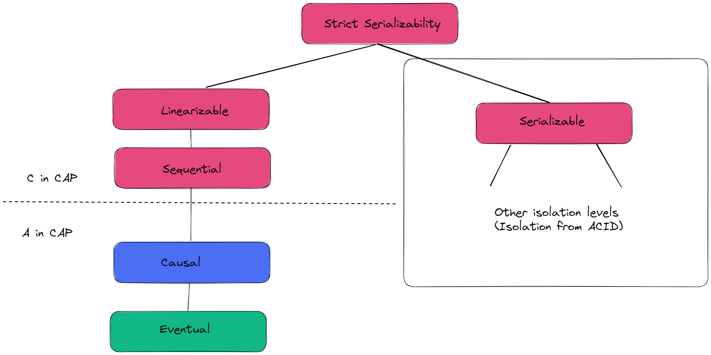
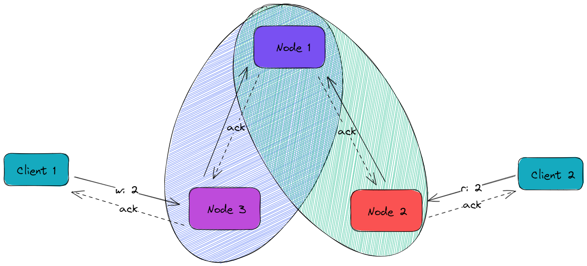
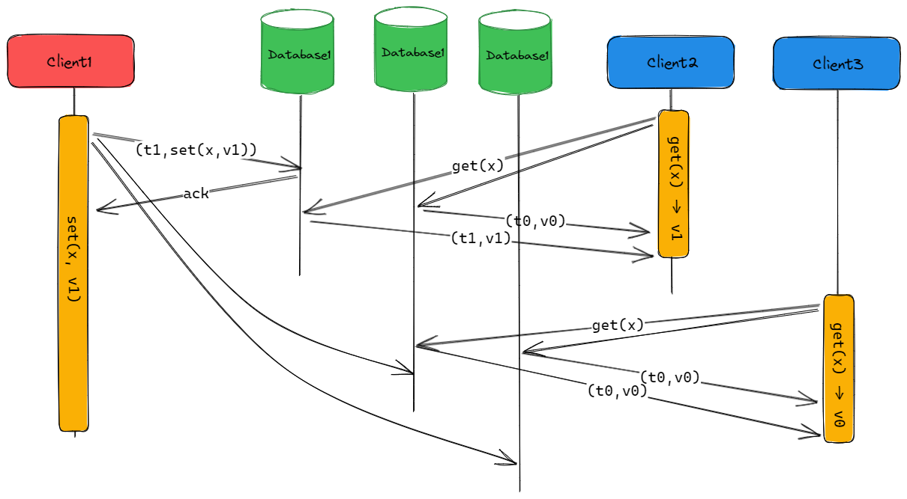
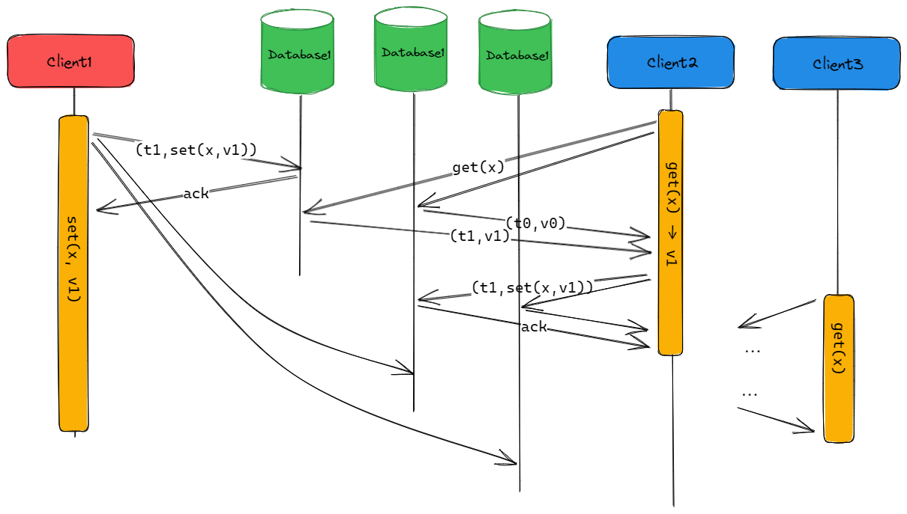

# Cassandra consistency guaranties

Cassandra is a type of NoSQL database system that is designed to work in a distributed and leaderless architecture.

Unlike other popular systems like MongoDB, all nodes in Cassandra can accept write operations, which has a significant impact on how consistency and availability can be achieved. According to the CAP theorem, Cassandra is classified as an Availability and Partition Tolerance system (AP) that favors availability in a more natural and efficient way, without requiring a single leader at any given time. This eliminates bottlenecks and the need for consensus to choose a primary node, which can cause some downtime in a single-leader system if the primary node fails.

Despite being an AP system, Cassandra can be configured to work as a Consistency and Partition Tolerance  system (CP), similar to a typical single-leader database. However, it achieves this in a slightly different way. This is why I want to discuss how Cassandra can be adjusted to achieve linearizability, which is also called strict consistency, as well as a certain level of isolation.

## Consistency in distributed systems

In the context of distributed systems, consistency denotes the requirement that all nodes in a distributed system must always maintain a uniform and synchronized view of the data. To be precise, if a particular node performs a write operation, the effects of that modification must be apparent to all other nodes in the system before any subsequent read operations can take place. Of course, this is a strong assumption. Therefore, there exist several types of consistency models, ranging from weak consistency models that allow for eventual consistency, to strong consistency models.

Linearizability [7] is a strong consistency model for distributed systems that defines how the results of concurrent operations on an object are ordered. It guarantees that every operation appears to have taken effect instantaneously at some point between its invocation and response, and that the system's behavior is equivalent to a serial execution of those operations in some order that respects the real-time order of their invocations.

In other words, linearizability ensures that the outcome of a concurrent execution of operations on an object appears as if the operations were executed one at a time in a sequential and consistent manner. Each operation in a linearizable system has a unique start time and end time, and any concurrent operations that overlap with it must complete either before it starts or after it completes.

Linearizability is a model that provides the illusion of a single copy of the object, even if it is replicated across multiple nodes in a distributed system. This makes it easier to reason about the behavior of the system and ensure that it meets its correctness.

When discussing consistency in distributed systems, we typically focus on the left side of the tree. On the other hand, the right side pertains to transactions and isolations in the context of ACID, which can also be essential for a system that requires transactions. Although Cassandra provides some flexibility in adjusting consistency and isolation, it's important to keep in mind that the database's primary objective is availability. Consequently, the mechanisms used in a leaderless database are not ideal for ensuring strong consistency and isolation.

Therefore, it's worth considering this issue not only in terms of the CAP theorem but also in terms of the PACELC theorem [6]. If we aim to enhance our consistency and isolation guarantees, we must be willing to tolerate a considerable decrease in latency and throughput.

## Quorum reads and writes

Cassandra offers tunable consistency, which means that clients can specify the level of consistency required for a given read or write operation. The consistency level can be set on a per-operation basis, and it determines how many replicas must respond to a read or write operation before the operation is considered successful.

In a leaderless architecture, write operations can be performed on any node in the cluster, and all nodes are responsible for maintaining consistency across the cluster. When a write operation is performed on one node, the updated data is replicated to other nodes in the cluster, ensuring that all nodes have the most recent version of the data.

The above-mentioned architecture is well-suited for applications that can function effectively with weaker consistency levels, such as eventual consistency, and do not require transactions and the associated isolation guarantees. This design choice eliminates the need for a single primary and avoids reliance on consensus to determine the primary node. Consequently, this architectural approach makes Cassandra an ideal database for highly available systems that require low latency and high throughput. However, the absence of transactions and isolation guarantees severely limits the range of operations that can be performed. This is why Cassandra is best suited for performing fast independent single writes and reads based on the partition key.

In a typical AP scenario, Cassandra allows us to set the write consistency level to the value of 1, which provides no durability guarantees. This means that data loss may occur in the event of a node failure. To ensure durability in Cassandra, we can set the write consistency level to a value higher than 1, which will require synchronization with additional nodes. This means that the write operation will only be considered successful if it has been written to the specified number of nodes. In terms of consistency, we can adjust the read consistency level. The default value of 1 prioritizes high availability and low latency at the expense of eventual consistency. These default properties are the most efficient for the purpose of the AP system that Cassandra was designed for.

### Cassandra higher consistency guaranties

In certain situations, our system may demand higher consistency guarantees, and we might be using a database system like Cassandra already, making it challenging to migrate to another database. Alternatively, our system may not require strong consistency except for a few exceptional use cases. In such scenarios, Cassandra offers the flexibility to increase consistency, but it comes at a cost.

To achieve linearizability consistency, we can opt for quorum reads and writes. This can be done by setting the write and read consistency levels to a majority. By doing so, we can ensure that the rule of r + w > n is met. As a result, during reads, we can expect to receive the latest data since we are guaranteed to read from at least one node that has seen the most recent write.

At first glance, setting the write and read consistency levels to majority may seem like enough to achieve linearizability consistency. However, this strategy is not enough to guarantee that we always get the latest data during reads [1]. The reason for this is that replication is not instantaneous in Cassandra, and data may not be immediately visible to other nodes during a write to the next replica. As a result, the situation shown below can occur.

To avoid such situations, Cassandra uses a technique called read repair. When a read operation is executed, Cassandra checks the consistency of the data by comparing the data returned by all replicas. If there are any discrepancies between the replicas, Cassandra will initiate a read repair process to reconcile the differences and bring all replicas back into sync. This process will pause the ongoing read operation until the repair is completed.

As shown above, applying read repair ensures that we achieve linearizability guarantees.

At this point, it's important to consider the cost of achieving consistency guarantees. In order to prevent stale data, we need to ensure that all writes and reads meet the quorum write and read criteria. This can lead to increased latency, as we need to wait for the quorum reads and writes. Additionally, if there are inconsistencies, we may need to wait for read repairs, which also adds latency. We can still adjust the r + w > n rule to optimize for either reads or writes. However, decreasing w for faster writes will increase r, resulting in slower reads, and vice versa. It's important to note that setting w to 1 means we lose the durability guarantee, while setting w=n or r=nmeans we lose availability, as we won't be able to write or read in the event of a single node failure. For this reason, setting both wand rto a majority seems like the most conservative strategy.

Increasing consistency guarantees can be quite costly, and according to PCAELC it must be balanced against deterioration in availability and latency.

## Cassandra isolation guaranties

Until now, we have only considered consistency in the case of a single operation (the left side of the tree). What about isolation guarantees in the case of multiple operations, or transactions? This aspect is much harder to solve optimally in a leaderless database like Cassandra. Although we accomplished linearizability for a single operation by applying quorum reads and writes with the help of read repairs, we cannot get any guarantees of isolation by using the same strategy. In the case of any concurrent writes, Cassandra simply applies the strategy of the last write wins. Unfortunately, this strategy automatically leads to lost updates.

The type of anomaly mentioned above automatically disqualifies Cassandra as a database that provides any level of isolation, which strongly limits our possibilities. This is one of the reasons why Cassandra is better suited for systems with many append writes that won't collide with each other, which can happen in the case of updates. However, it is not always possible to fulfill that constraint. To some extent, Cassandra allows us to solve that problem by using one of the most basic isolation guarantees, which is Compare and Set (CAS). It allows us to make a read and then write only when our condition on the given read is met. Unfortunately, it is not possible to guarantee that with simple quorum read and write. To get that functionality, we require a property called total order broadcast [1], which can be achieved by consensus algorithms like Paxos or Raft. However, these algorithms come with the cost of reduced availability and increased latency.

To achieve CAS, Cassandra offers lightweight transactions (LWT) which utilize the basic Paxos algorithm [3]. However, this functionality comes at a high cost of reduced availability, increased latency, and severely reduced throughput. Achieving CAS requires four round trips between nodes in Cassandra clusters and in case of increased contention, the throughput of the system drops drastically [2]. Another crucial thing to note is that we cannot mix LWT with regular consensus writes when running them on the same column [4].

## Conclusion

In summary, Cassandra is a distributed NoSQL database system that operates in a leaderless architecture.

While it offers tunable consistency that enables clients to increase consistency levels and provides CAS through LWT, it is still predominantly an AP database. Therefore, it works best for use cases that do not require strict consistency or isolation guarantees.

It is ideal for fast independent single append writes and reads based on partition key, and it is suitable for systems that require high availability, low latency, and high throughput, even if it comes at the cost of eventual consistency and a lack of isolation guarantees.

More information can be found here:

1. https://www.youtube.com/watch?v=noUNH3jDLC0&list=PLeKd45zvjcDFUEv_ohr_HdUFe97RItdiB&index=20
2. https://www.youtube.com/watch?v=wcxQM3ZN20c&t=1409s
3. https://martinfowler.com/articles/patterns-of-distributed-systems/paxos.html
4. https://icircuit.net/cassandra-mixing-regular-writes-with-lwt-writes/3228
5. https://stackoverflow.com/questions/56795239/why-is-cassandra-not-linearizable-when-quorum-based-read-and-writes-are-used
6. https://en.wikipedia.org/wiki/PACELC_theorem
7. https://aphyr.com/posts/313-strong-consistency-models